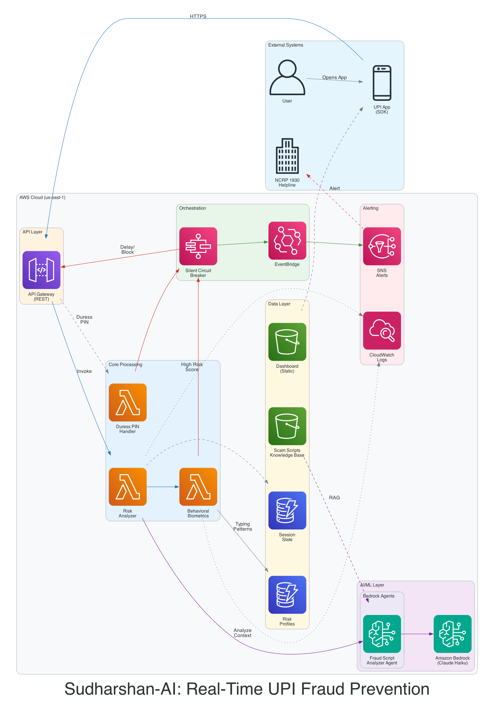
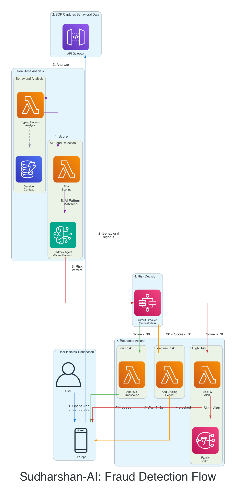

<p align="center">
  
</p>

<h1 align="center">Sudharshan-AI</h1>

<p align="center">
  <strong>Real-Time Fraud Sentinel for the UPI & OCEN Ecosystem</strong>
</p>

<p align="center">
  <a href="https://github.com/charanpool/sudharshan-ai"></a>
  <a href="https://github.com/charanpool/sudharshan-ai"></a>
  <a href="https://github.com/charanpool/sudharshan-ai/blob/main/LICENSE"></a>
  <a href="https://github.com/charanpool/sudharshan-ai"></a>
</p>

<p align="center">
  <em>"We don't just detect stolen cards. We detect stolen minds."</em>
</p>

---


## Overview

Sudharshan-AI is a real-time, privacy-first fraud prevention system that detects psychological coercion during UPI transactions. Unlike traditional systems that react after fraud occurs, Sudharshan-AI intervenes **before** funds leave the victim's account.

**Target Problem:** "Digital Arrest" scams where victims are psychologically manipulated into transferring money while on a call with scammers impersonating authorities.

**Key Stat:** India lost ₹1,750 crore to cyber fraud in H1 2024, with 7.4 lakh complaints filed to NCRP.

---

## Hackathon

- **Event:** AI for Bharat (AWS + Hack2Skill)
- **Track:** AI for Retail, Commerce & Market Intelligence
- **Team:** Sudharshan (Solo)
- **Prize Pool:** ₹40 Lakhs

---

## Core Features

| Feature | Description | AWS Service |
|---------|-------------|-------------|
| Agentic Fraud-Script Analysis | AI analyzes transactions against known scam patterns | Bedrock Agents + Claude Haiku |
| Silent Circuit Breaker | Holds suspicious transactions without alerting scammer | Step Functions |
| Behavioral Biometrics | Detects typing pattern anomalies and hesitation | Lambda |
| Duress PIN | Secret PIN triggers silent alert | Lambda + DynamoDB |
| Risk Dashboard | Real-time fraud monitoring | S3 Static Hosting |

---

## Architecture



---

## Process Flow



---

## Documentation

| Document | Description |
|----------|-------------|
| [REQUIREMENTS.md](docs/REQUIREMENTS.md) | Functional, technical, and compliance requirements |
| [DESIGN.md](docs/DESIGN.md) | System architecture and AWS service justification |
| [Idea Submission PPT](docs/presentations/) | Hackathon presentation |

---

## Project Structure

```
sudharshan-ai/
├── README.md                      # Project overview
├── docs/
│   ├── REQUIREMENTS.md            # Requirements specification
│   ├── DESIGN.md                  # System design document
│   ├── diagrams/
│   │   ├── architecture.png       # AWS architecture diagram
│   │   └── process-flow.png       # Fraud detection flow
│   └── presentations/
│       └── Idea Submission.pdf    # Hackathon presentation
├── src/
│   ├── lambda/
│   │   └── risk_analyzer/
│   │       ├── handler.py           # Main Lambda orchestrator
│   │       ├── core/                # Core logic engines
│   │       │   ├── analyzer.py      # Bedrock AI integration
│   │       │   └── behavioral.py    # Behavioral deviation engine
│   │       ├── utils/               # Supporting utilities
│   │       │   ├── models.py        # Data structures
│   │       │   └── reporting.py     # Investigator report logic
│   │       ├── circuit_breaker.asl.json # Step Functions definition
│   │       └── scam_intelligence.json   # Scam script KB
│   └── shared/
│       └── constants.py             # System-wide configuration
├── seed_baselines.py                # Mock data seeder
├── test_local_mock.py               # Enhanced verification suite
└── pyproject.toml                   # uv configuration
```


---

## Quick Start

### Prerequisites
- Python 3.9+
- AWS Account with Bedrock access
- AWS CLI configured

### Local Setup

```bash
# Clone the repository
git clone https://github.com/charanpool/sudharshan-ai.git
cd sudharshan-ai

# Install dependencies using uv
uv sync
```

### Test Locally

```bash
uv run python src/lambda/risk_analyzer/handler.py
```


### Sample API Request

```json
{
  "session_id": "test-123",
  "user_id": "user-456",
  "signals": {
    "typing_speed_wpm": 25,
    "hesitation_count": 8,
    "is_on_call": true
  },
  "transaction": {
    "amount": 100000,
    "recipient_type": "new"
  }
}
```

---

## Tech Stack

- **AI/ML:** Amazon Bedrock (Claude Haiku), Bedrock Agents, Bedrock Knowledge Bases
- **Compute:** AWS Lambda (Python)
- **Storage:** Amazon DynamoDB, Amazon S3
- **Orchestration:** AWS Step Functions
- **API:** Amazon API Gateway
- **Monitoring:** Amazon CloudWatch, Amazon SNS

---

## Estimated Cost

| Component | Cost |
|-----------|------|
| Prototype Phase | $15-30 (with Free Tier) |
| Production (per 1M txns) | ~$50-100 |

---

## Roadmap

| Phase | Timeline | Deliverables |
|-------|----------|--------------|
| Prototype | Feb 10-22, 2026 | Core MVP with Bedrock + Step Functions |
| Phase 2 | Q2 2026 | Mobile SDK with voice sentiment |
| Phase 3 | Q3 2026 | Edge AI for offline, Nitro for enterprise |
| Pilot | Q3 2026 | B2B pilot with regional banks |

---

## Compliance

- **DPDP Act 2023:** Privacy-first design, no raw audio/video stored
- **RBI Advisory 2025:** Real-time fraud prevention
- **IndiaAI Mission:** Citizen protection through sovereign AI

---

## Contact

**Team Lead:** Sai Charan Koppuravuri

- **LinkedIn:** [charan-koppuravuri](https://www.linkedin.com/in/charan-koppuravuri/)
- **GitHub:** [charanpool](https://github.com/charanpool)

---

*Built for AI for Bharat Hackathon (AWS + Hack2Skill)*
